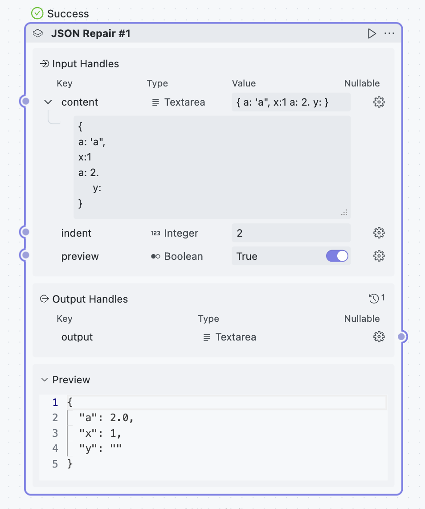

  <h1>JSON Repair</h1>
  

    
  

  

## Share Block

### JSON Repair

Fix JSON formatting errors

**Input Parameters**:

- `content`: JSON content to be repaired
- `indent`: Output indentation, set to `0` for single-line output
- `preview`: Whether to enable preview

**Output**

- `output`: Repaired JSON content

## Thanks

This Project is based on [json_repair](https://github.com/mangiucugna/json_repair) 